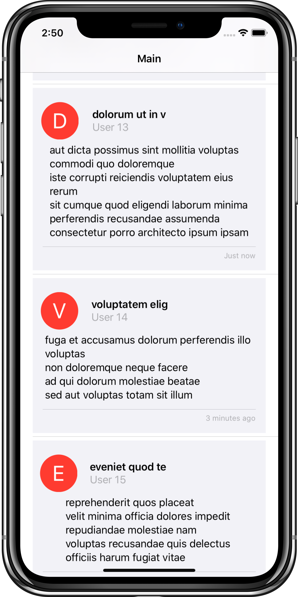

<!-- Header -->
<h1>Combiny</h1>

<!-- Body -->
## SwiftUI Networking with Combine

**Combiny** is a SwiftUI app that show demo post from https://jsonplaceholder.typicode.com. I'm learning Combine and so decided to build an app in which I consume a REST API, and parse the json using Combine. 
I only spent a few hours in the morning putting Combiny together, but plan to add more features in the near future. Happy learning 😉

## Screenshots

  <kbd></kbd>
  <kbd></kbd>
  <kbd></kbd>

<!-- Footer -->
## Tech
- Swift 5
- JSON
- SwiftUI
- iOS 13
- Combine
- Codable
- REST API
